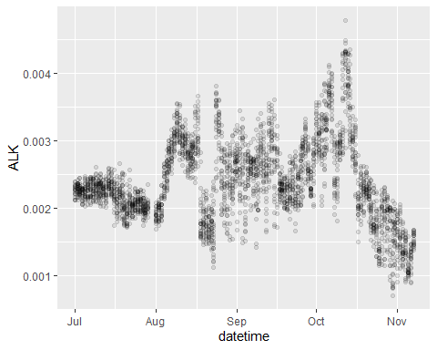

Calculating Carbonate Components from Casco Bay Data Using seacarb
================
Curtis C. Bohlen

-   [Introduction](#introduction)
-   [Analyzing the Carbonate Chemistry
    System](#analyzing-the-carbonate-chemistry-system)
-   [Relationship betweeen Salinity and Calculated
    Alkalinity](#relationship-betweeen-salinity-and-calculated-alkalinity)
-   [Pairs Plot](#pairs-plot)
-   [Some other approaches to showing complex
    data.](#some-other-approaches-to-showing-complex-data)
-   [Plotting up by Julian Day](#plotting-up-by-julian-day)


# Introduction

The primary R implementation of CO2SYS is the package `seacarb`. This
notebook Was an early effort to explore use of that tool, by applying it
to CBEP OA data. It also includes a few exploratory ggplot() graphics
for depicting patterns in different ways. This was an early effort, and
does not incorporate many lessons learned later while developing other
SoCB graphics.

``` r
library(tidyverse)
#> Warning: package 'tidyverse' was built under R version 4.0.5
#> -- Attaching packages --------------------------------------- tidyverse 1.3.1 --
#> v ggplot2 3.3.5     v purrr   0.3.4
#> v tibble  3.1.6     v dplyr   1.0.7
#> v tidyr   1.1.4     v stringr 1.4.0
#> v readr   2.1.0     v forcats 0.5.1
#> Warning: package 'ggplot2' was built under R version 4.0.5
#> Warning: package 'tidyr' was built under R version 4.0.5
#> Warning: package 'dplyr' was built under R version 4.0.5
#> Warning: package 'forcats' was built under R version 4.0.5
#> -- Conflicts ------------------------------------------ tidyverse_conflicts() --
#> x dplyr::filter() masks stats::filter()
#> x dplyr::lag()    masks stats::lag()
library(readxl)
library(seacarb)
#> Warning: package 'seacarb' was built under R version 4.0.5
#> Loading required package: oce
#> Warning: package 'oce' was built under R version 4.0.5
#> Loading required package: gsw
#> Warning: package 'gsw' was built under R version 4.0.5
#> Loading required package: sf
#> Linking to GEOS 3.9.1, GDAL 3.2.1, PROJ 7.2.1
#> Loading required package: testthat
#> Warning: package 'testthat' was built under R version 4.0.5
#> 
#> Attaching package: 'testthat'
#> The following object is masked from 'package:dplyr':
#> 
#>     matches
#> The following object is masked from 'package:purrr':
#> 
#>     is_null
#> The following objects are masked from 'package:readr':
#> 
#>     edition_get, local_edition
#> The following object is masked from 'package:tidyr':
#> 
#>     matches
#> Loading required package: SolveSAPHE
#> Warning: package 'SolveSAPHE' was built under R version 4.0.5
library(magrittr)   # for the `%$%` pipe, which is convenient with `seacarb`.
#> 
#> Attaching package: 'magrittr'
#> The following objects are masked from 'package:testthat':
#> 
#>     equals, is_less_than, not
#> The following object is masked from 'package:purrr':
#> 
#>     set_names
#> The following object is masked from 'package:tidyr':
#> 
#>     extract
library(GGally)
#> Warning: package 'GGally' was built under R version 4.0.5
#> Registered S3 method overwritten by 'GGally':
#>   method from   
#>   +.gg   ggplot2
```

\#Loading the Data

``` r
the_data <- read_excel('CascoBayOADataFall2016.xlsx', na = 'NA',
                       col_types = c(
                         'text',
                         rep('numeric', 17))) %>%
  mutate(datetime = as.POSIXct(datetime, tz = 'UTC'))
  
ggplot(the_data, aes(datetime,ph)) + 
  geom_point() + 
  scale_x_datetime(name = '', date_breaks = 'months', date_labels = '%B')
```


# Analyzing the Carbonate Chemistry System

(Using default parameters – which may not be appropriate here).  
The carb function has a somewhat awkward UI, but it pulls together all
the parts of the carbonate system, based on whichever two variables you
have available (plus T and S). Here’s an example from the seacarb
manual.

``` r
data(seacarb_test_P0)
data <- seacarb_test_P0
carbd <- carb(flag=data$flag, var1=data$var1, var2=data$var2, S=data$S, T=data$T, P=data$P, Sit=data$Sit, Pt=data$Pt)
#> Warning in calculate_carb(flag, var1, var2, S, T, Patm, P, Pt, Sit, NH4t = 0, :
#> Given Alk and [CO3--], there were 2 solutions for pH. The one closest to pH7 was
#> chosen !

#----------------------------------------------------------------------
# Simple xy plot
qplot(carbd$pH,carbd$pCO2)
```


``` r
rm(carbd, data, seacarb_test_P0)
```

Applying this to our data, we have the following. the parameter “flag =
21 is for”pCO2 and pH given" as is the case here. Temperature and
salinity help determine the equilibrium constants that drive the
calculation.

``` r
complete_data <- the_data %>%
  select(c(1:8, 11,13,14,15, 16, 18)) %>%
  filter(across(1:10, ~! is.na(.)))

carbsystem <- complete_data %$% 
  carb(flag = 21, var1 = pco2, var2 = ph, S = sal, T = temp, gas = 'standard')

dat <- complete_data %>% select(yyyy, mm, dd, hh, datetime) %>% 
  bind_cols(select(carbsystem, c(-1)))

rm(complete_data)
```

``` r
plt <- ggplot(dat) +
  geom_point(aes(datetime, OmegaAragonite, color = 'Omega Aragonite'), size = .5, alpha = 0.25) +
  geom_point(aes(datetime, OmegaCalcite, color = "Omega Calcite"), size = .5, alpha = 0.25) +
  geom_hline(yintercept = 1.6, lty = 2, color = 'blue') +
  annotate("text", x = as.POSIXct("2016/01/01"), y = 2, label = "Omega = 1.6",
           hjust = 0, color = 'blue') +
  geom_hline(yintercept = 1, lty = 2, color = 'black') +
  annotate("text", x = as.POSIXct("2015/04/01"), y = 0.75, label = "Omega = 1", hjust = 0)
plt
```


# Relationship betweeen Salinity and Calculated Alkalinity

``` r
plt <- ggplot(dat, aes(S, ALK)) + geom_point( alpha = 0.25) +
    geom_smooth(method = 'lm')
plt
#> `geom_smooth()` using formula 'y ~ x'
```


# Pairs Plot

``` r
plt <- select(dat,S, T, pH) %>% #, pCO2, ALK, OmegaAragonite) %>%
  ggpairs()
plt
```


# Some other approaches to showing complex data.

``` r
plt <- ggplot(dat, aes(S, ALK)) + 
  stat_density_2d(aes(fill = ..level..), geom = "polygon", colour="white")
plt
```


``` r
plt <- ggplot(dat, aes(S, ALK)) +
  geom_point(alpha = 0.25) +
               geom_density_2d(color = 'white')
plt
```


``` r
plt <- ggplot(dat, aes(datetime, ALK)) + 
  geom_point(alpha = 0.1)
plt
```



# Plotting up by Julian Day

``` r
tmp <- the_data %>% 
  mutate(jday = julianDay(datetime)-
           julianDay(ISOdatetime(year = yyyy,
                                 month = 1,
                                 day = 1,
                                 hour=0,
                                 min=0,
                                 sec=0)))

plt <- ggplot(tmp, aes(jday, pco2)) + 
  geom_point(alpha = .2)

plt
#> Warning: Removed 92 rows containing missing values (geom_point).
```


``` r
plt <- ggplot(tmp, aes(jday, pco2)) + 
  geom_point(alpha = .25) +
  geom_smooth()
plt
#> `geom_smooth()` using method = 'gam' and formula 'y ~ s(x, bs = "cs")'
#> Warning: Removed 92 rows containing non-finite values (stat_smooth).
#> Warning: Removed 92 rows containing missing values (geom_point).
```


``` r
plt <- ggplot(tmp, aes(jday, log(pco2))) + 
  geom_hex() + 
  scale_fill_distiller(palette=4, direction=-1) + 
  geom_smooth()

plt
#> Warning: Removed 92 rows containing non-finite values (stat_binhex).
#> `geom_smooth()` using method = 'gam' and formula 'y ~ s(x, bs = "cs")'
#> Warning: Removed 92 rows containing non-finite values (stat_smooth).
```


``` r
plt <- ggplot(tmp, aes(jday, ph)) +
  geom_point(alpha = 0.25) +
  geom_smooth()
plt
#> `geom_smooth()` using method = 'gam' and formula 'y ~ s(x, bs = "cs")'
```


