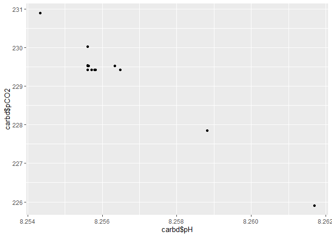
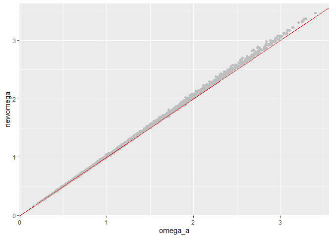

Recalculating Omega from FOCB and UNH OA Data from Casco Bay
================
Curtis C. Bohlen

  - [Introduction](#introduction)
  - [Install Libraries](#install-libraries)
  - [Load Libraries](#load-libraries)
  - [Load Data](#load-data)
  - [Demo from seacarb](#demo-from-seacarb)
  - [Calculate Carbonate Parameters](#calculate-carbonate-parameters)
      - [CBEP / SMCC Data](#cbep-smcc-data)
  - [FOCB](#focb)


# Introduction

We want to check calculations of OA parameters from both FOCB and UNH,
using CO2SYS or its derivatives, here the R package seacarb.

We do this for limited data from summer and fall of 2016 – the one
period with good data coverage from bot hdata sets.

The two monitoting statiosn are not near oneanother, so there is no
reason conditions should be identical, but they should be more or les
similar.

# Install Libraries

# Load Libraries

``` r
library(seacarb)
```

    ## Loading required package: oce

    ## Loading required package: gsw

    ## Loading required package: testthat

``` r
library(tidyverse)
```

    ## -- Attaching packages ---------------------------------------------------------------------------------------------------------------- tidyverse 1.3.0 --

    ## v ggplot2 3.3.2     v purrr   0.3.4
    ## v tibble  3.0.1     v dplyr   1.0.0
    ## v tidyr   1.1.0     v stringr 1.4.0
    ## v readr   1.3.1     v forcats 0.5.0

    ## -- Conflicts ------------------------------------------------------------------------------------------------------------------- tidyverse_conflicts() --
    ## x dplyr::filter()  masks stats::filter()
    ## x purrr::is_null() masks testthat::is_null()
    ## x dplyr::lag()     masks stats::lag()
    ## x dplyr::matches() masks tidyr::matches(), testthat::matches()

``` r
library(readxl)
library(lubridate)
```

    ## 
    ## Attaching package: 'lubridate'

    ## The following objects are masked from 'package:base':
    ## 
    ##     date, intersect, setdiff, union

``` r
library(CBEPgraphics)
load_cbep_fonts()
```

# Load Data

``` r
cbep_data <- read_excel("CascoBayOADataFALL2016.xlsx", 
    col_types = c("text", "numeric", "numeric", 
        "numeric", "numeric", "numeric", 
        "numeric", "numeric", "numeric", 
        "numeric", "numeric", "numeric", 
        "numeric", "numeric", "numeric", 
        "numeric", "numeric", "numeric"),
    na='NA') %>%
  mutate(datetime2 = make_datetime(yyyy, mm, dd, hh,0),
         doy2 = as.numeric(format(datetime2, format = '%j')),
         site = 'SMCC',
         Month = factor(mm, levels = 1:12, labels = month.abb),
         TimeOfDay = cut(hh,breaks=6, labels = c('Late Night', 'Early Morning',
                                                   'Morning','Afternoon',
                                                   'Evening', 'Night')))

# Using some base R code to change column content without changing order of columns
# Tidyverse mutate(deletes and old column, and adds a new one, thus changing order.)

cbep_data$datetime <- cbep_data$datetime2
# DOY is already correct

cbep_data <- cbep_data[, !(names(cbep_data)== 'doy2')]
# finally, remove data with key missing values, which appear to choke seacarb
cbep_data <- cbep_data[! (is.na(cbep_data$pco2) | is.na(cbep_data$ph) |
                             is.na(cbep_data$temp) | is.na(cbep_data$sal)),] 
```

``` r
focb_data <- read_excel("CMS1DataFALL2016.xlsx", 
    col_types = c("skip", "date", "numeric", 
        "numeric", "numeric", "numeric", 
        "numeric", "numeric", "numeric", 
        "numeric", "numeric", "numeric", 
        "numeric", "numeric", "numeric", 
        "numeric", "numeric", "date", 
        "numeric")) %>%
  mutate(datetime2 = make_datetime(yyyy, mm, dd, hh,0),
         doy2 = as.numeric(format(datetime, format = '%j')),
         site = 'Cousins',
         Month = factor(mm, levels = 1:12, labels = month.abb),
         TimeOfDay = cut(hh,breaks=6, labels = c('Late Night', 'Early Morning',
                                                   'Morning','Afternoon',
                                                   'Evening', 'Night')))

# Using some base R code to change column content without changing order of columns
# Tidyverse mutate(deletes and old column, and adds a new one, thus changing order.)

focb_data$doy <- focb_data$doy2
# datetime is already correct -- but includes minutes,
# which is why we have datetime2, which is rounded to the hour.

focb_data <- focb_data[, !(names(focb_data) == 'doy2')]

# finally, remove data with key missing values, which appear to choke seacarb
focb_data <- focb_data[! (is.na(focb_data$pco2) | is.na(focb_data$ph) |
                             is.na(focb_data$temp) | is.na(focb_data$sal)),] 
```

# Demo from seacarb

secarb comes with a demop data set, which we can use here to see

``` r
data(seacarb_test_P0)
data <- seacarb_test_P0
carbd <- carb(flag=data$flag, var1=data$var1, var2=data$var2, S=data$S, T=data$T, P=data$P, Sit=data$Sit, Pt=data$Pt)

ggplot(carbd, aes(carbd$pH,carbd$pCO2)) + geom_point()
```

    ## Warning: Use of `carbd$pH` is discouraged. Use `pH` instead.

    ## Warning: Use of `carbd$pCO2` is discouraged. Use `pCO2` instead.

<!-- -->

``` r
rm(carbd, data, seacarb_test_P0)
```

flag indicates which parameters were actually measured. For our data,
based on pH and pCO<sub>2</sub>, we want flag = 21.

# Calculate Carbonate Parameters

## CBEP / SMCC Data

``` r
cbep <- carb(flag = 21, cbep_data$pco2, cbep_data$ph, S=cbep_data$sal, T=cbep_data$temp,
     Patm=1, P=0, Pt=0, Sit=0,
     k1k2="x", kf="x", ks="d", pHscale="T",
     b="u74", gas="potential", 
     warn="y", eos="eos80",
     long=-69, lat=40)   # I don't think we need the lat and long....

cbep_data$newomega <- cbep$OmegaAragonite
```

``` r
ggplot(cbep_data, aes(omega_a, newomega)) + geom_point(color = 'grey') +
  geom_abline(intercept = 0, slope = 1, color = 'red')
```

<!-- -->
This shows a slight bias towards higher values

# FOCB

Unfortunately, seacarb offers only three choices for pH scales, and
those are “T”, for total, “F” for free, and “SWS” for sea water scale. I
am uncertain which scale to use, based on the NBS scale. Judging by
Pimenta and Greer 2018, teh scale is similar to total scale, with errors
that can be as high as one tenth of a pH point. It is NOT the preferred
approach.

> Pimenta, A. AND J. Grear. Guidelines for Measuring Changes in Seawater
> pH and Associated Carbonate Chemistry in Coastal Environments of the
> Eastern United States. U.S. EPA Office of Research and Development,
> Washington, DC, EPA/600/R-17/483, 2018.

``` r
focb <- carb(flag = 21, focb_data$pco2, focb_data$ph, S=focb_data$sal, T=focb_data$temp,
     Patm=1, P=0, Pt=0, Sit=0,
     k1k2="x", kf="x", ks="d", pHscale="T",
     b="u74", gas="potential", 
     warn="y", eos="eos80",
     long=-69, lat=40)   # I don't think we need the lat and long....

focb_data$newomega <- focb$OmegaAragonite
```

``` r
ggplot(focb_data, aes(omega_a, newomega)) + geom_point(color = 'grey') +
    geom_abline(intercept = 0, slope = 1, color = 'red')
```

<!-- -->
So, the FOCB calculations are consistently inaccurate, at least the way
I’ve set them up. WE might see if usingone of the oher pH scales makes
adiffernece.
