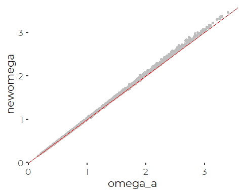
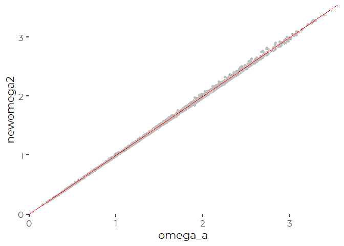
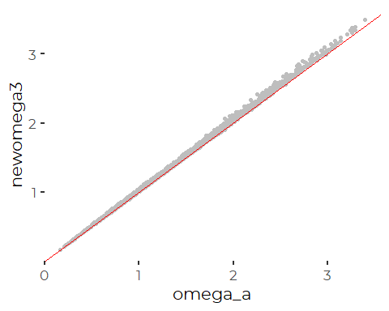
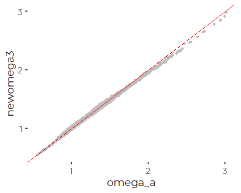
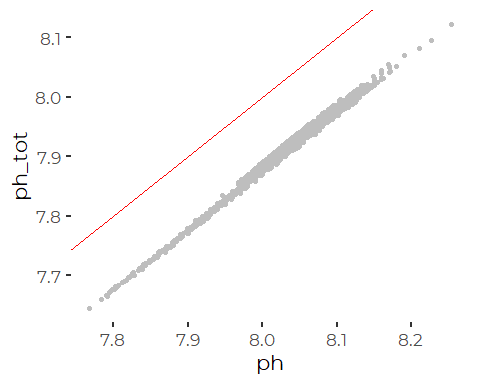

Recalculating Omega from FOCB and UNH OA Data from Casco Bay
================
Curtis C. Bohlen

  - [Introduction](#introduction)
  - [Install Libraries](#install-libraries)
  - [Load Libraries](#load-libraries)
  - [Load Data](#load-data)
  - [Calculate Carbonate Parameters](#calculate-carbonate-parameters)
      - [CBEP / SMCC Data](#cbep-smcc-data)
  - [FOCB](#focb)
  - [Duplicating the Calculations Conducted by Chris Hunt of
    UNH](#duplicating-the-calculations-conducted-by-chris-hunt-of-unh)
  - [Check CBEP Calculations in
    Python](#check-cbep-calculations-in-python)
      - [Import CBEP python results](#import-cbep-python-results)
          - [Folder References](#folder-references)
          - [Load Python Data and Plot](#load-python-data-and-plot)
      - [Accuracy Comparisons](#accuracy-comparisons)
  - [Use python to recalculate FOCB Omega
    values](#use-python-to-recalculate-focb-omega-values)
      - [Load FOCB Python Data and
        Plot](#load-focb-python-data-and-plot)
  - [Caclulate mean offset](#caclulate-mean-offset)
  - [Linear Models](#linear-models)
  - [Conclusions](#conclusions)


# Introduction

In this notebook, we run calculations of the seawater carbonate systems
from two data series in Casco Bay, using a variety of methods and a
variety of tools. The goal is to check calculations, determine how
assumptions may affect results, and figure out how to calculate
carbonate chemistry using the tools we have available.

We will check calculations of OA parameters from both FOCB and UNH,
using CO2SYS or, more concretely, its derivatives in Python and R.

We principally explore on the R Package seacarb, but it does not provide
a facility for working with pH measured on the NBS scale, which is what
FOCB uses. As a result, we have also run some calculations in PyCO2SYS.

We do this for limited data from summer and fall of 2016, because there
is good data coverage for that period from both data sets.

The two monitoring stations are not near one another, so there is no
reason conditions should be identical, but they should be more or less
similar.

# Install Libraries

# Load Libraries

``` r
library(seacarb)
```

    ## Loading required package: oce

    ## Loading required package: gsw

    ## Loading required package: testthat

``` r
library(tidyverse)
```

    ## -- Attaching packages ---------------------------------------------------------------------- tidyverse 1.3.0 --

    ## v ggplot2 3.3.2     v purrr   0.3.4
    ## v tibble  3.0.3     v dplyr   1.0.2
    ## v tidyr   1.1.2     v stringr 1.4.0
    ## v readr   1.3.1     v forcats 0.5.0

    ## -- Conflicts ------------------------------------------------------------------------- tidyverse_conflicts() --
    ## x dplyr::filter()  masks stats::filter()
    ## x purrr::is_null() masks testthat::is_null()
    ## x dplyr::lag()     masks stats::lag()
    ## x dplyr::matches() masks tidyr::matches(), testthat::matches()

``` r
library(readxl)
library(readr)
library(lubridate)
```

    ## 
    ## Attaching package: 'lubridate'

    ## The following objects are masked from 'package:base':
    ## 
    ##     date, intersect, setdiff, union

``` r
library(CBEPgraphics)
load_cbep_fonts()
```

# Load Data

``` r
cbep_data <- read_excel("CascoBayOADataFALL2016.xlsx", 
    col_types = c("text", "numeric", "numeric", 
        "numeric", "numeric", "numeric", 
        "numeric", "numeric", "numeric", 
        "numeric", "numeric", "numeric", 
        "numeric", "numeric", "numeric", 
        "numeric", "numeric", "numeric"),
    na='NA') %>%
  mutate(datetime2 = make_datetime(yyyy, mm, dd, hh,0),
         doy2 = as.numeric(format(datetime2, format = '%j')),
         site = 'SMCC',
         Month = factor(mm, levels = 1:12, labels = month.abb),
         TimeOfDay = cut(hh,breaks=6, labels = c('Late Night', 'Early Morning',
                                                   'Morning','Afternoon',
                                                   'Evening', 'Night')))

# Using base R code to change column content without changing order.
# Tidyverse mutate() deletes an old column, and adds a new one, thus changing order.)

cbep_data$datetime <- cbep_data$datetime2
# DOY is already correct
cbep_data <- cbep_data[, !(names(cbep_data)== 'doy2')]
# finally, remove data with key missing values, which appear to choke seacarb
cbep_data <- cbep_data[! (is.na(cbep_data$pco2) | is.na(cbep_data$ph) |
                             is.na(cbep_data$temp) | is.na(cbep_data$sal)),] 
```

``` r
focb_data <- read_excel("CMS1DataFALL2016.xlsx", 
    col_types = c("skip", "date", "numeric", 
        "numeric", "numeric", "numeric", 
        "numeric", "numeric", "numeric", 
        "numeric", "numeric", "numeric", 
        "numeric", "numeric", "numeric", 
        "numeric", "numeric", "date", 
        "numeric")) %>%
  mutate(datetime2 = make_datetime(yyyy, mm, dd, hh,0),
         doy2 = as.numeric(format(datetime, format = '%j')),
         site = 'Cousins',
         Month = factor(mm, levels = 1:12, labels = month.abb),
         TimeOfDay = cut(hh,breaks=6, labels = c('Late Night', 'Early Morning',
                                                   'Morning','Afternoon',
                                                   'Evening', 'Night')))

# Using base R code to change column content without changing order.
# Tidyverse mutate() deletes an old column, and adds a new one, thus changing order.)

focb_data$doy <- focb_data$doy2
# datetime is already correct -- but includes minutes,
# which is why we have datetime2, which is rounded to the hour.

focb_data <- focb_data[, !(names(focb_data) == 'doy2')]

# finally, remove data with key missing values, which appear to choke seacarb
focb_data <- focb_data[! (is.na(focb_data$pco2) | is.na(focb_data$ph) |
                             is.na(focb_data$temp) | is.na(focb_data$sal)),] 
```

# Calculate Carbonate Parameters

## CBEP / SMCC Data

``` r
cbep <- carb(flag = 21, cbep_data$pco2, cbep_data$ph,
             S=cbep_data$sal, T=cbep_data$temp,
             Patm=1, P=0, Pt=0, Sit=0,
             k1k2="x", kf="x", ks="d", pHscale="T",
             b="u74", gas="potential", 
             warn="y", eos="eos80",
             long=-69, lat=40)   # I don't think we need the lat and long....

cbep_data$newomega <- cbep$OmegaAragonite
```

``` r
ggplot(cbep_data, aes(omega_a, newomega)) + geom_point(color = 'grey') +
  geom_abline(intercept = 0, slope = 1, color = 'red')+
  theme_cbep()
```

<!-- -->
This shows a slight bias towards higher values. The values we calculated
are consistently slightly higher than the valus calculated by UNH.

# FOCB

According to its documentation, seacarb offers only three choices for pH
scales, and those are “T”, for total, “F” for free, and “SWS” for sea
water scale.

Thus seacarb can not handle the electrochemical data collected by FOCB,
which is measured in the “NBS” scale.

Judging by Pimenta and Greer 2018, the NBS scale is similar to total
scale, but differences can be as high as one tenth of a pH point. The
result is that any effort to use seacarb to handle FOCB’s data is
doomed.

> Pimenta, A. AND J. Grear. Guidelines for Measuring Changes in Seawater
> pH and Associated Carbonate Chemistry in Coastal Environments of the
> Eastern United States. U.S. EPA Office of Research and Development,
> Washington, DC, EPA/600/R-17/483, 2018.

We ran calculations based on seacarb, but FOCB’s reported Omega values
were consistently much lower than what we calculated. We do not present
the results here, because seacarbs limitations mean the calculations
were wrong. We do not want to mislead readers by including technically
incorrect code.

We did calculate better values for the FOCB data using python. Results
are given below.

# Duplicating the Calculations Conducted by Chris Hunt of UNH

I received an e-mail from Chris Hunt of UNH, who ran the calculations on
the SMCC data to determine the carbonate system parameters. In hte
e-mail he described how he set up his calculation of carbonate
parameters using CO2SYS. He runs the analysis on Matlab, using the
following code and settings:

``` octave
for i=1:length(lvl3)
    if ~isnan(lvl3(i,7)) & ~isnan(lvl3(i,17)) & ~isnan(lvl3(i,27)) & ~isnan(lvl3(i,37))
        [CO2SYS_DATA,HEADERS,NICEHEADERS]=CO2SYS(lvl3(i,27),lvl3(i,37),4,3,lvl3(i,17),lvl3(i,7),lvl3(i,7),0,0,0,0,1,9,1);
        lvl3(i,52)=CO2SYS_DATA(16);     %omega-a
        lvl3(i,53)=CO2SYS_DATA(15);     %omega-c
        lvl3(i,54)=CO2SYS_DATA(1);      %TALK
        lvl3(i,55)=CO2SYS_DATA(2);      %DIC
    end
end
```

> where lvl3(i,7) = temperature,  
> lvl3(i,17) = salinity, lvl3(i,27) = pCO2, lvl3(i,37) = pH.

> I’m using pressure, silicate, and phosphate all equal to zero (the
> effects of those are pretty small). \* pH data are on the Total scale
> (Option 1). \* I’m using the K1K2 constants of Cai and Wang 1998
> (Option 9). \* I’m using the KSO4 of Dickson and \* TB of Uppstrom
> (Option 1).

We can approximate Chris Hunt’s SEACARB calculations as follows:

``` r
cbep2 <- carb(flag = 21, cbep_data$pco2, cbep_data$ph,
              S=cbep_data$sal, T=cbep_data$temp,
              Patm=1, P=0, Pt=0, Sit=0,
              k1k2="w14",                  # I'm not given the option of Cai and Wang in seacarb
              kf="x",                      # Chris did not mention this
              ks="d",                      # From Dixon 1990
              pHscale="T",  
              b="u74",                     # Uppstrom 1974
              gas="potential", 
              warn="y", eos="eos80",
              long=-69, lat=40)   # I don't think we need the lat and long....

cbep_data$newomega2 <- cbep2$OmegaAragonite
```

``` r
ggplot(cbep_data, aes(omega_a, newomega2)) + geom_point(color = 'grey') +
  geom_abline(intercept = 0, slope = 1, color = 'red') +
  theme_cbep()
```

<!-- -->

Since seacarb does not provide an option for the Cai and Wang 1998
equilibrium constants, we tried all the options listed in the man pages,
to evaluate which looked most like the results provided by Chris Hunt.
None of them provided an exact match, but several are very close (with
only small symmetric deviations from perfect correlation).

What we observed were the following:

1.  No change with k1k2 = ‘x’ or k1k2 = ‘m10’.  
2.  Bias is WORSE with k1k2=‘r’.  
3.  The bias vanishes if we go with k1k2=‘m06’ or ‘w14’.  
4.  k1k2 = ‘mo6’ and k1k2 = ‘w14’ provide nearly identical results.

# Check CBEP Calculations in Python

We also ran similar calculations in PyCO2SYS version 1.4.1 in Python
3.77

> Humphreys, M. P., Gregor, L., Pierrot, D., van Heuven, S. M. A. C.,
> Lewis, E. R., and Wallace, D. W. R. (2020). PyCO2SYS: marine carbonate
> system calculations in Python. Version 1.4.1. Zenodo.
> <doi:10.5281/zenodo.3744275>.

Code and results are in the ‘PyCO2SYS\_calc’ folder. The code is in
‘quickcarbonatechem.py’ and results are in ‘co2sys\_out.csv’.

## Import CBEP python results

### Folder References

``` r
daughter <- 'PyCO2SYS_Calc'
#me   <- getwd()
#daughter  <- file.path(me,daughterfldrnm)
```

### Load Python Data and Plot

``` r
fn <- 'cbepco2sys_out.csv'
fpath = file.path(daughter, fn)

pyres <- read_csv(fpath)
```

    ## Parsed with column specification:
    ## cols(
    ##   omega_a = col_double(),
    ##   omega_c = col_double(),
    ##   ta = col_double(),
    ##   dic = col_double()
    ## )

``` r
pyres <- pyres[complete.cases(pyres),]

cbep_data$newomega3 <- pyres$omega_a

ggplot(cbep_data, aes(omega_a, newomega3)) + geom_point(color = 'grey') +
  geom_abline(intercept = 0, slope = 1, color = 'red') +
  theme_cbep()
```

<!-- -->
So, even trying to repeat Chris Hunt’s Calculations EXACTLY in Python,
produces slightly different results. That’s disturbing….

## Accuracy Comparisons

``` r
cor(cbep_data[,c('omega_c', 'newomega', 'newomega2', 'newomega3')])
```

    ##             omega_c  newomega newomega2 newomega3
    ## omega_c   1.0000000 0.9995345 0.9996042 0.9996504
    ## newomega  0.9995345 1.0000000 0.9999748 0.9996872
    ## newomega2 0.9996042 0.9999748 1.0000000 0.9997974
    ## newomega3 0.9996504 0.9996872 0.9997974 1.0000000

So, measured by CORRELATON, Chris’s values and the values calculated by
the python code are most similar. Looking at the graphic, however, it is
clear there is bias to the results especially at higher values. That
bias would not be picked up in a correlation statistic. For that we need
root mean squared error.

``` r
test <- cbep_data %>%
  select(omega_a, newomega, newomega2, newomega3)  %>%
  summarize_all(~sqrt(mean((.-omega_a)^2, na.rm=TRUE)))
knitr::kable(test)
```

| omega\_a | newomega | newomega2 | newomega3 |
| -------: | -------: | --------: | --------: |
|        0 | 1.758431 |  1.716543 |  1.765699 |

So, our best fit with the values sent to us by Chris Hunt use K1K2
parameters = ‘w14’ or nearly equivalently, ‘m06’ (not shown). That
leaves me wondering if Chris actually used the parameters he thinks he
did, or if there is some other factor at work here, calculating values
using (slightly) different software on different computers.

# Use python to recalculate FOCB Omega values

### Load FOCB Python Data and Plot

``` r
fn <- 'focbco2sys_out.csv'
fpath = file.path(daughter, fn)

pyres <- read_csv(fpath)
```

    ## Parsed with column specification:
    ## cols(
    ##   omega_a = col_double(),
    ##   omega_c = col_double(),
    ##   ta = col_double(),
    ##   dic = col_double(),
    ##   ph_tot = col_double()
    ## )

``` r
pyres <- pyres[complete.cases(pyres),]

focb_data$newomega3 <- pyres$omega_a
focb_data$ph_tot <- pyres$ph_tot

ggplot(focb_data, aes(omega_a, newomega3)) + geom_point(color = 'grey') +
  geom_abline(intercept = 0, slope = 1, color = 'red') +
  theme_cbep()
```

<!-- -->

So, That explains the VERY different results we got when we tried the
different pH scales. Just as with the results we found with Chris’s
calculations, our results are not identical to what FOCB submitted to
us. We might be able to get a closer match if we switched to using
different K1 and K2 constants.

So, the problem is not is inconsistent calculations, the problem lies in
using different pH scales, which are surprisingly incommensurate.

We would like to reframe FOCB’s observed pH in terms of total pH to
facilitate comparisons with the UNH data. We modified the Python script
slightly to add an estimated pH value on the total scale, again using
PyCO2SYS.

``` r
ggplot(focb_data, aes(ph, ph_tot)) + geom_point(color = 'grey') +
  geom_abline(intercept = 0, slope = 1, color = 'red') +
  theme_cbep()
```

<!-- -->
Interesting. This shows a (nearly) linear offset of pH values. Estimated
pH values on the Total pH scale are about 0.125 of a pH point lower than
pH measured on the NBS scale.

# Caclulate mean offset

``` r
test <- focb_data %>%
  select(ph, ph_tot)  %>%
  mutate(diff = ph_tot - ph) %>%
  summarize(meandif = mean(diff, na.rm=TRUE))
knitr::kable(test)
```

|     meandif |
| ----------: |
| \-0.1208048 |

# Linear Models

``` r
ph_lm <- lm(ph_tot~ ph, data = focb_data)
summary(ph_lm)$coefficients
```

    ##               Estimate  Std. Error  t value     Pr(>|t|)
    ## (Intercept) -0.2181984 0.013639190 -15.9979 5.807015e-55
    ## ph           1.0121372 0.001699665 595.4923 0.000000e+00

``` r
ph_lm_0 <- lm(ph_tot~ ph + 0, data = focb_data)
summary(ph_lm_0)$coefficients
```

    ##     Estimate   Std. Error  t value Pr(>|t|)
    ## ph 0.9849471 1.473387e-05 66849.18        0

So, basic slope is close to 1, not indistinguishably different from one
on these data, either with or without an intercept.

Lets get a more robust estimate of the offset, by centering the data on
the x axis, here he NBS pH observations.

``` r
mnph    <- mean(focb_data$ph, na.rm=TRUE)
mnphtot <- mean(focb_data$ph_tot, na.rm=TRUE)
phcentered    <- scale(focb_data$ph,     scale=FALSE)
phtotcentered <- scale(focb_data$ph_tot, scale=FALSE)
ph_lm_c <- lm(focb_data$ph_tot~ phcentered)
coef(ph_lm_c)[1] - mnph
```

    ## (Intercept) 
    ##  -0.1208048

``` r
mnphtot-mnph
```

    ## [1] -0.1208048

So the two approaches both provide identical estimates of the offset

# Conclusions

What I found is this:  
1\. FOCB and UNH are making slightly different assumptions about the
equilibrium constants. Those different assumptions make a tiny
difference in results, but not enough to worry about.

2.  Even using identical parameter settings in different versions of
    CO2SYS, we don’t get identical results; each program, maybe each
    computer, produces very slightly different values (again, not enough
    to worry about, but it makes error checking difficult\!).

3.  The selection of the correct pH scale makes a HUGE difference in
    Omega estimates (on the order of 30%).

4.  CO2SYS offers the option to output an estimated pH in different pH
    scales. When I used that facility (in Python) to calculate the pH
    FOCB “would have seen” had they been using a Total pH scale, the
    estimated pH is almost exactly 0.12 pH units lower than what FOCB
    reported directly.

5.  That difference is enough to “explain” how FOCB could have lower
    pCO2 and higher pH at Cousins Island, but still show significantly
    lower estimated Omega values. A difference in estimated pH of 0.1 pH
    units can change estimated omega by around 0.5 or 0.6.
