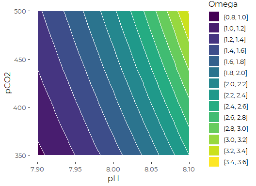

CO2 System Error Propagation
================
Curtis C. Bohlen

-   [Introduction](#introduction)
-   [Load Libraries](#load-libraries)
-   [Systematic Exploration of Error](#systematic-exploration-of-error)
    -   [Create Mock Data](#create-mock-data)
    -   [Calculate Carbonate
        Parameters](#calculate-carbonate-parameters)
    -   [Graphical Display of Omega as a function of pH and
        PCO<sub>2</sub>](#graphical-display-of-omega-as-a-function-of-ph-and-pco2)
-   [Varying Temperature and
    Salinity](#varying-temperature-and-salinity)


# Introduction

Friends of Casco Bay uses less accurate electrochemical pH sensors,
rather than the more expensive Field Effect Transistor sensors or
colorimetric pH technology. As a result, they measure pH in NBS pH
Scale, not on the Total pH scale, which is recommended by Pimenta and
Greer 2018 (and many other references).

> Pimenta, A. AND J. Grear. Guidelines for Measuring Changes in Seawater
> pH and Associated Carbonate Chemistry in Coastal Environments of the
> Eastern United States. U.S. EPA Office of Research and Development,
> Washington, DC, EPA/600/R-17/483, 2018.

Several references, however, suggest that for situations with
substantial differences in pCO<sub>2</sub>, such as estuarine
environments, the potentiometric approach using a glass electrode can
provide adequate precision.

We want to explore the impact of apparently small changes in pH
observations, and by extension, other field measurements as collected by
typical monitoring programs might affect estimation of the other
components of the carbonate system, especially total alkalinity and
Omega.

# Load Libraries

``` r
library(seacarb)
#> Warning: package 'seacarb' was built under R version 4.0.5
#> Loading required package: oce
#> Warning: package 'oce' was built under R version 4.0.5
#> Loading required package: gsw
#> Warning: package 'gsw' was built under R version 4.0.5
#> Loading required package: sf
#> Warning: package 'sf' was built under R version 4.0.5
#> Linking to GEOS 3.9.1, GDAL 3.2.1, PROJ 7.2.1
#> Loading required package: testthat
#> Warning: package 'testthat' was built under R version 4.0.5
library(tidyverse)
#> Warning: package 'tidyverse' was built under R version 4.0.5
#> -- Attaching packages --------------------------------------- tidyverse 1.3.1 --
#> v ggplot2 3.3.5     v purrr   0.3.4
#> v tibble  3.1.4     v dplyr   1.0.7
#> v tidyr   1.1.3     v stringr 1.4.0
#> v readr   2.0.1     v forcats 0.5.1
#> Warning: package 'ggplot2' was built under R version 4.0.5
#> Warning: package 'tibble' was built under R version 4.0.5
#> Warning: package 'tidyr' was built under R version 4.0.5
#> Warning: package 'readr' was built under R version 4.0.5
#> Warning: package 'dplyr' was built under R version 4.0.5
#> Warning: package 'forcats' was built under R version 4.0.5
#> -- Conflicts ------------------------------------------ tidyverse_conflicts() --
#> x readr::edition_get()   masks testthat::edition_get()
#> x dplyr::filter()        masks stats::filter()
#> x purrr::is_null()       masks testthat::is_null()
#> x dplyr::lag()           masks stats::lag()
#> x readr::local_edition() masks testthat::local_edition()
#> x dplyr::matches()       masks tidyr::matches(), testthat::matches()
library(readxl)

library(viridis)
#> Warning: package 'viridis' was built under R version 4.0.5
#> Loading required package: viridisLite
#> Warning: package 'viridisLite' was built under R version 4.0.5
library(CBEPgraphics)
load_cbep_fonts()
```

# Systematic Exploration of Error

## Create Mock Data

``` r
ph        <- rep(seq(7.9, 8.1, 0.02), times =11)
pco2      <- rep(seq(350, 500, 15), each=11)

mock_data <- tibble(ph=ph, pco2=pco2, temp = 15, sal = 30)
```

## Calculate Carbonate Parameters

``` r
carb_data = carb(flag = 21, mock_data$pco2, mock_data$ph, S=mock_data$sal,
                 T=mock_data$temp,
                 Patm=1, P=0, Pt=0, Sit=0,
                 k1k2="x", kf="x", ks="d", pHscale="T",
                 b="u74", gas="potential", 
                 warn="y", eos="eos80",
                 long=-69, lat=40)   # I don't think we need the lat and long....
```

## Graphical Display of Omega as a function of pH and PCO<sub>2</sub>

``` r
ggplot(carb_data, aes(x=pH, y=pCO2, z=OmegaAragonite)) +
  geom_contour_filled(color='white', breaks = seq(0,4, 0.2)) +
  scale_fill_viridis_d(name = 'Omega') +
  theme_cbep(base_size = 12)
```


So, loosely speaking, an error of one tenth of a pH point can shift the
estimated omega value from roughly 0.9 or 1.0 to around 1.5. To shift
omega as far based on an error measuring pCO<sub>2</sub>, you’d need to
be “off” on your estimate of pCO<sub>2</sub> by around 150 micro
Atmospheres.

# Varying Temperature and Salinity

``` r
temp        <- rep(seq(14, 16, 0.2), times =11)
sal      <- rep(seq(29, 31, 0.2), each=11)

mock_data <- tibble(ph=8.0, pco2=500, temp = temp, sal = sal)

carb_data = carb(flag = 21, mock_data$pco2, mock_data$ph,
                 S=mock_data$sal, T=mock_data$temp,
                 Patm=1, P=0, Pt=0, Sit=0,
                 k1k2="x", kf="x", ks="d", pHscale="T",
                 b="u74", gas="potential", 
                 warn="y", eos="eos80",
                 long=-69, lat=40)   # I don't think we need the lat and long....
```

``` r
v <- viridis(14)
v[c(7,8)]
#> [1] "#24878EFF" "#1F998AFF"
```

``` r
ggplot(carb_data, aes(x=T, y=S, z=OmegaAragonite)) +
  geom_contour_filled(breaks = seq(0,4, 0.2)) +
  geom_contour(color='white') +
  scale_fill_manual(name = 'Omega', values = v[c(7,8)]) +
  theme_cbep(base_size = 12) +
  theme(legend.position = 'none')
```


While the shape looks similar, the scale is quite different. Full scale
here is only a range of 0.3, less than 1/10th the scale of impact of
potential errors in pH.

Note that for a complete version of this I would need to explore the
full parameter space, rather than take selected two dimensional slices
through it.
